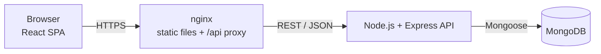
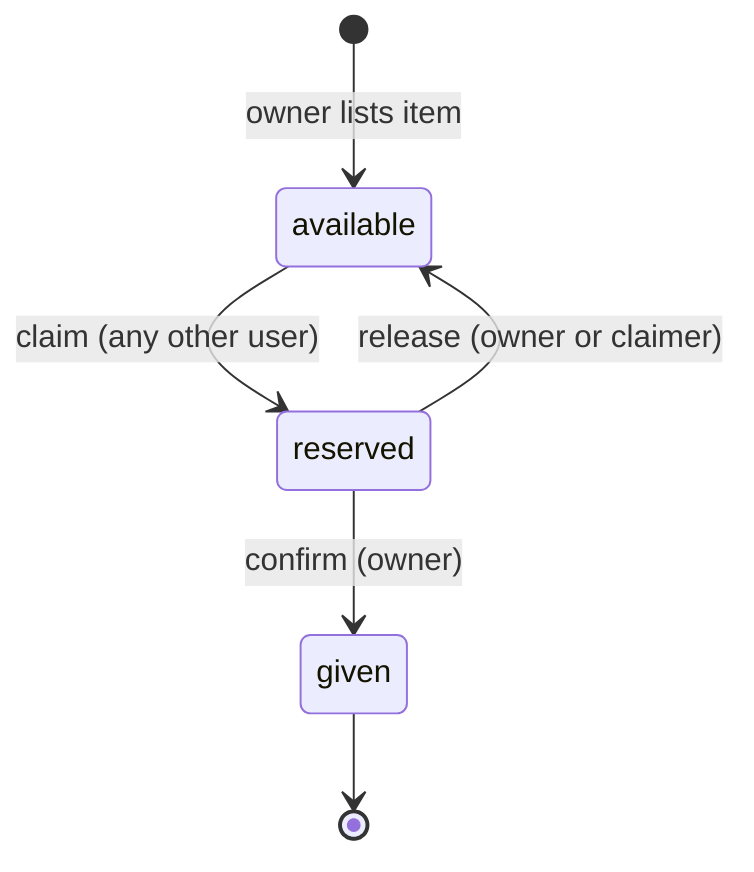

# SecondChance – System Architecture

## 1. Overview

SecondChance is a three-tier web application:



| Tier | Technology | Responsibility |
|------|-----------|----------------|
| Presentation | React (provided), served by nginx | UI, calls REST API |
| Application | Node.js 20, Express 4 | Auth, business rules, validation |
| Data | MongoDB 7 + Mongoose | Persistence, indexes, atomic updates |

## 2. Backend layering

```
routes  ->  middleware (auth, validate)  ->  controllers  ->  models (Mongoose)
                                                   \-> utils (password, token, helpers)
errors bubble up to a single errorHandler that maps them to HTTP responses
```

* **routes/** – URL + verb wiring only.
* **validators/** – zod schemas. Every request body/query/params is parsed, coerced and stripped of unknown keys before a controller sees it.
* **controllers/** – business rules; no HTTP plumbing beyond `req`/`res`.
* **models/** – schemas, indexes, JSON serialisation (hides secrets).
* **middleware/errorHandler.js** – one place that converts `AppError`, Mongoose errors, duplicate keys (E11000) and version conflicts into consistent `{ "error": { "message", "details" } }` responses.

## 3. Data model (MongoDB)

**users** `{ name, email (unique), passwordHash, city, bio, role, ratingSum, ratingCount, failedLoginAttempts, lockUntil }`

**items** `{ title, description, category, condition, tags[], images[], city, location (GeoJSON Point), status, owner→users, claimedBy→users, reservedAt, givenAt, __v }`

**reviews** `{ item→items, reviewer→users, reviewee→users, rating 1-5, comment }`

Relationships use references (not embedding) because items and reviews grow independently and are queried on their own. Owner name/rating is joined with `populate` on read.

### Indexes

| Collection | Index | Purpose |
|-----------|-------|---------|
| users | `email` unique | Duplicate-account protection under concurrency |
| items | text(title×10, tags×5, description) | Keyword search with relevance ranking |
| items | `location` 2dsphere | "Near me" radius search |
| items | `{status, createdAt}`, `{category, status}`, `{owner, createdAt}`, `{claimedBy}` | Browse, filter and "my items" queries |
| reviews | `{item, reviewer}` unique | One review per person per hand-over |
| reviews | `{reviewee, createdAt}` | Profile review list |

## 4. Item lifecycle



## 5. Concurrency safety

| Risk | Solution |
|------|----------|
| Two users claim the same item simultaneously | Claim is a **single atomic `findOneAndUpdate`** whose filter includes `status: 'available'`. MongoDB serialises writes to one document, so exactly one caller matches; others get `409`. Tested with 8 parallel claimers. |
| Two people edit a listing at once (lost update) | Mongoose `optimisticConcurrency` + client-supplied `version`; stale writes get `409`. |
| Duplicate reviews from double-clicks | Unique compound index `{item, reviewer}`. |
| Lost rating updates | Aggregates maintained with atomic `$inc`, never read-modify-write. |
| Duplicate registrations | Unique index on `email` (+ friendly pre-check). |
| Parallel password guessing | Atomic `$inc` failed-attempt counter → 15-minute lock. |

Note: the review + aggregate update are two writes; a failure of the second triggers a compensating delete. If you later need strict multi-document atomicity, run MongoDB as a replica set and wrap them in `session.withTransaction()`.

## 6. Security

* Passwords hashed with bcrypt (12 rounds; ≤72 chars enforced).
* Stateless JWT (`Authorization: Bearer …`), verified on every request and checked against the DB so deleted users lose access immediately.
* Generic login error + constant-time dummy compare (no user enumeration), account lockout, rate limiting (`/api` 300 req/15 min, `/api/auth` 30 req/15 min).
* `helmet` headers, CORS allow-list, 100 kB body limit.
* zod strips unknown keys and rejects non-string values → NoSQL operator injection (`{"$gt": ""}`) is blocked.
* Public profile and item endpoints never expose e-mail; `claimedBy` is visible only to the two parties.
* Secrets come from environment variables; the app refuses to start in production without `JWT_SECRET`.
* Container runs as the unprivileged `node` user.

## 7. Deployment

`docker-compose.yml` runs `mongo`, `api` and (with `--profile full`) `web` (nginx + React build). nginx proxies `/api` to the API so the browser sees one origin and no CORS is needed in production. The API exposes `/health` for container and load-balancer probes.

## 8. Known limitations / next steps

* Images are stored as URLs; add S3/Cloudinary upload for real files.
* No e-mail verification / password reset yet.
* No in-app messaging between giver and receiver.
* Consider refresh tokens (httpOnly cookie) if token lifetime must be short.
